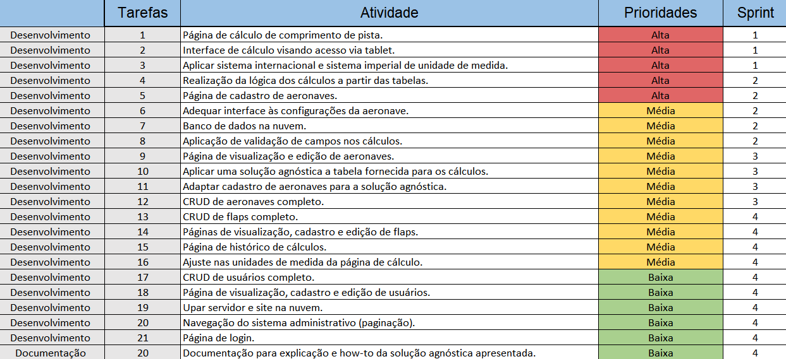
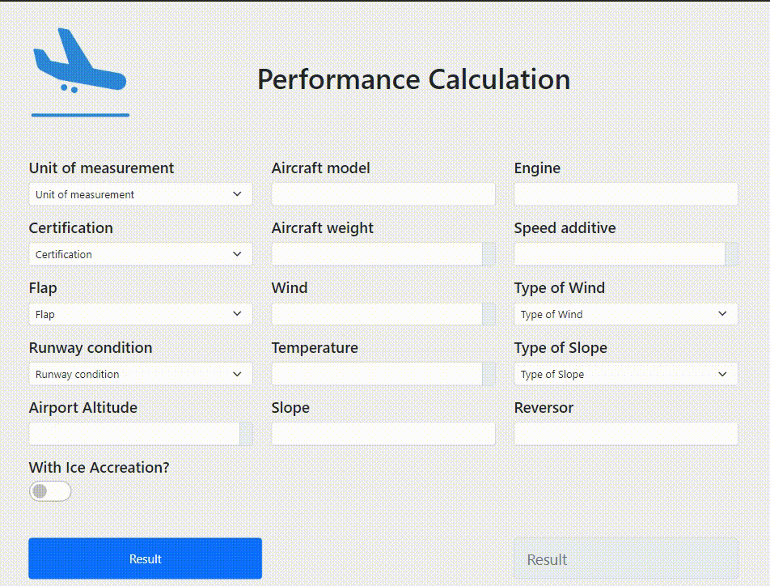

  <h1> EQUIPE APOLO - APRENDIZAGEM POR PROJETOS INTEGRADOS 3º SEMESTRE ADS - 2022 </h1>   <H2>Visão do Projeto</H2>

  O projeto tem como finalidade criar uma interface para que os pilotos de aeronaves possam, a partir dos parâmetros considerados, calcular a distância necessária para realizar o pouso de forma segura. Para tal cálculo, uma tabela foi disponibilizada para que todos os fatores sejam levados em consideração. Tais fatores são: modelo, motor, certificação, peso e flap de pouso da aeronave, altitude do aeroporto, temperatura, vento, inclinação da pista, uso de reversor, aditivo de velocidade, acúmulo de gelo, condição de pista e nível de aplicação de frenagem.

* Requistos funcionais
   ---
- [x] Cadastros de modelos de aeronaves;
- [x] Perfis diferentes (administrador, usuário);
- [x] Interface amigável para cálculo de perfomace via celular ou tablet;
- [x] Gerar cálculo do comprimento mínimo da pista de pouso pelos fatores considerados;
- [x] Gerar histórico dos cálculos realizados;

* Requisitos não funcionais
  ---
- [x] Linguagem Typescript;
- [x] Documentações;

 

## Backlog do Produto

 

 

<H1>Resultado Final </H1>

<h4> Entrega da Sprint 1 </h4>

 

<h4> Entrega da Sprint 2 </h4>

 

<h4> Entrega da Sprint 3 </h4>

 

<h4> Entrega da Sprint 4 </h4>

 

### Link do Github                                                
|  | [Link](https://github.com/EquipeApolo/API_3_Semestre) |
|:---:|:---:|

## Tecnologias Utilizadas  

- [HTML5 & CSS3](https://www.w3schools.com/): Linguagens de marcação
- [Typescript](https://www.typescriptlang.org/): Linguagem de programação
- [Git](https://git-scm.com): Versionamento
- [GitHub](https://github.com/): Armazenamento de código
- [Teams](https://teams.microsoft.com): Comunicação
- [Whimsical](https://whimsical.com): Prototipagem
- [Node](https://nodejs.org/): Runtime
- [React](https://pt-br.reactjs.org/): Framework

 

<H1>Contribuições pessoais</H1>

Durante o desenvolvimento do projeto, minha responsabilidade central foi a criação e integração das páginas de visualização, cadastro e edição de usuários, assim como a implementação do CRUD para a entidade aeronave 

<h3>Hard Skills</h3>
<ul>
  <li><strong>CRUD de Usuário completo:</strong> Nível de Proficiência:  Competente</li>
  <li><strong>Pagina de visualização, cadastro e edição de usuario:</strong> Nível de Proficiência:  Competente</li>
  <li><strong>CRUD de aeronave:</strong> Nível de Proficiência:  Autônomo com pouca ajuda</li>
</ul>

<h3>Soft Skills</h3>
<ul>
  <li>
    <strong>Comunicação:</strong> Habilidade de expressar ideias de forma clara e eficaz, tanto na fala quanto na escrita. Isso inclui ouvir ativamente e compreender os outros.
  </li>
  <li>
    <strong>Trabalho em Equipe:</strong> Capacidade de colaborar com colegas, compartilhar responsabilidades e contribuir para objetivos comuns.
  </li>
  <li>
    <strong>Empatia:</strong> Capacidade de compreender e considerar os sentimentos e perspectivas dos outros, desenvolvendo relações interpessoais mais fortes.
  </li>
  <li>
    <strong>Criatividade:</strong> Capacidade de gerar novas ideias e soluções, pensar fora da caixa e abordar problemas de maneira inovadora.
  </li>
</ul>
