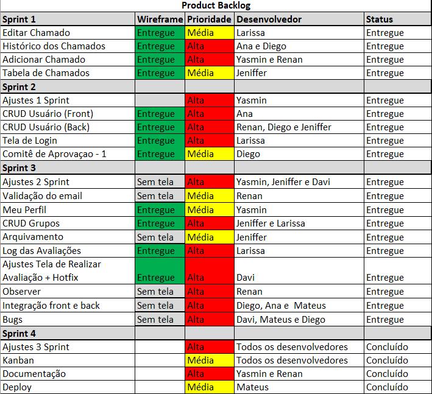

<h1 align="center"> EQUIPE PEÔNIA   APRENDIZAGEM POR PROJETOS INTEGRADOS 4º SEMESTRE ADS - 2023 </h1>  <H2>Visão do Projeto</H2>

 O projeto consiste em desenvolver uma plataforma de gerenciamento de chamados internos para a Ionic Health. Essa plataforma deve ser capaz de receber demandas de correção urgente (hotfix) e novas funcionalidades (feature), direcionando-as para as equipes responsáveis. Além disso, deve permitir a aprovação de novas funcionalidades por um comitê de avaliação. Com essa plataforma, a empresa poderia melhorar a comunicação interna, colaboração entre as equipes e monitorar o desempenho do processo de desenvolvimento de produtos.

* Requistos funcionais
   ---
- [x] Cadastro de grupo de usuários;
- [x] Permissão por grupo e por usuário;
- [x] Distinção de usuários por times;
- [x] Fila de chamados para cada time;
- [x] Configuração e personalização de formulário de chamados;
- [x] Árvore de Decisão para escalonamento de chamados;
- [x] Cadastro de soluções para problemas conhecidos;
- [x] Formulário de abertura de chamado com indicação de interessados;

* Requisitos não funcionais
  ---
- [x] React;
- [x] NodeJS;

 

## Backlog do produto

 

 

<H1>Resultado Final </H1>

<h4> Entrega da Sprint 1 </h4>

 

https://user-images.githubusercontent.com/86448876/229383850-07c43960-d344-4bc1-937e-2391f1a4f639.mp4

<h4> Entrega da Sprint 2 </h4>

 

https://user-images.githubusercontent.com/86115352/233875755-5246a1ff-8b22-466d-9b65-061e43662dbd.mp4

https://user-images.githubusercontent.com/86115352/233876936-91b7e7fe-1404-4cfc-a987-a5cbba259e0d.mp4

https://user-images.githubusercontent.com/86115352/233877053-97b2f78b-c03e-4a55-a84d-9995c23f0cf9.mp4

<h4> Entrega da Sprint 3 </h4>

 

https://github.com/peonia-api/API_4_Semestre/assets/86448876/52bd5e2f-9586-40a0-b2df-8b6c3db24b9a
 

<h4> Entrega da Sprint 4 </h4>

https://github.com/peonia-api/API_4_Semestre/assets/86115352/90962519-6285-4790-8d80-379a15f303a5

https://github.com/peonia-api/API_4_Semestre/assets/86115352/c558bbaf-6f40-47b3-bd0f-d16a869c4a41
    
 

    
 

### Link do Github                                                
|  | [Link](https://github.com/peonia-api/API_4_Semestre) |
|:---:|:---:|

## Tecnologias Utilizadas  

- [HTML5 & CSS3](https://www.w3schools.com/): Linguagens de marcação
- [TypeScript](https://www.typescriptlang.org/): Linguagem de programação
- [Git](https://git-scm.com): Versionamento
- [GitHub](https://github.com/): Armazenamento de código
- [Teams](https://teams.microsoft.com): Comunicação
- [Figma](https://www.figma.com): Prototipagem
- [NodeJS](https://nodejs.org/): Runtime
- [ReactJS](https://pt-br.reactjs.org/): Framework
- [TypeORM](https://typeorm.io/): Framework
- [DevOps](https://azure.microsoft.com/pt-br/products/devops): Planejamento
- [PostgreSQL](https://www.postgresql.org/): Banco de dados
- [EmailJS](https://www.emailjs.com/): Observer e redefinição de senha
- [Nodemailer](https://www.npmjs.com/package/nodemailer): Observer e redefinição de senha
- [Google Cloud Platform](https://cloud.google.com/?utm_source=google&utm_medium=cpc&utm_campaign=latam-BR-all-pt-dr-BKWS-all-all-trial-p-dr-1605194-LUAC0014411&utm_content=text-ad-none-any-DEV_c-CRE_512285710746-ADGP_Hybrid%20%7C%20BKWS%20-%20PHR%20%7C%20Txt%20~%20GCP_General-KWID_43700062788251476-kwd-295915745166&utm_term=KW_gcp-ST_GCP&gclid=EAIaIQobChMI9bqWjJOq_wIVtyKtBh04WQpvEAAYASAAEgLSfvD_BwE&gclsrc=aw.ds&hl=pt-br): Deployment

 

<H1>Contribuições pessoais</H1>

No processo de construção do projeto, minha atribuição abrangeu a criação do Histórico dos Chamados, a implementação do CRUD para usuários, a gestão do Comitê de Aprovação, integração entre o front-end e back-end, além da resolução de bugs.

<h3>Hard Skills</h3>
<ul>
  <li><strong>Criação do Histórico dos Chamados</strong> Nível de Proficiência: Autônomo </li>
  <li><strong>Implementação do CRUD para Usuários</strong> Nível de Proficiência: Autônomo </li>
  <li><strong>Gestão do Comitê de Aprovação</strong> Nível de Proficiência: Autônomo com pouca ajuda</li>
  <li><strong>Integração entre o Front-end e Back-end</strong> Nível de Proficiência: Com ajuda</li>
  <li><strong>Resolução de Bugs</strong> Nível de Proficiência: Com ajuda</li>
</ul>

<h3>Soft Skills</h3>
<ul>
  <li>
    <strong>Comunicação:</strong> Habilidade de expressar ideias de forma clara e eficaz, tanto na fala quanto na escrita. Isso inclui ouvir ativamente e compreender os outros.
  </li>
  <li>
    <strong>Trabalho em Equipe:</strong> Capacidade de colaborar com colegas, compartilhar responsabilidades e contribuir para objetivos comuns.
  </li>
  <li>
    <strong>Empatia:</strong> Capacidade de compreender e considerar os sentimentos e perspectivas dos outros, desenvolvendo relações interpessoais mais fortes.
  </li>
  <li>
    <strong>Criatividade:</strong> Capacidade de gerar novas ideias e soluções, pensar fora da caixa e abordar problemas de maneira inovadora.
  </li>
</ul>
